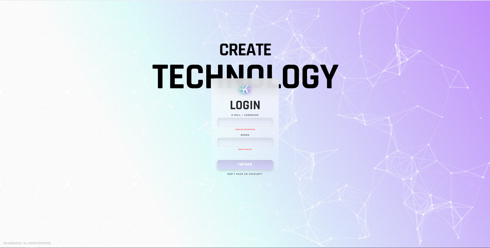
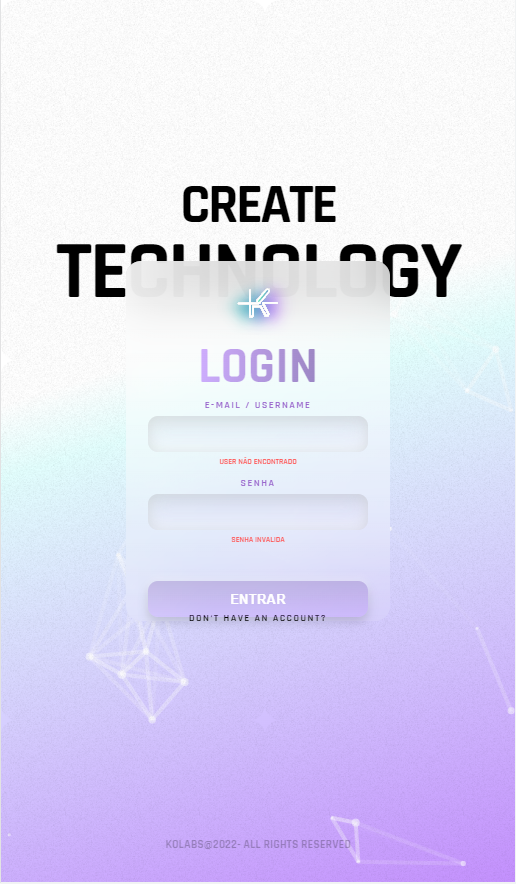

<h3 align="center">
    <b>Kolabs</b>  
</h3>


# Índice

- [Sobre](#sobre)
- [Tecnologias Utilizadas](#tecnologias-utilizadas)
- [Screenshots](#screenshots)
- [Como Usar](#como-usar)
- [Como Contribuir](#como-contribuir)

<a id="sobre"></a>

## :bookmark: Sobre

O <strong>Kolabs</strong> é uma releitura de uma landing page de acordo com o design disponibilizado no [FIGMA](https://www.figma.com/file/cAyzhcn3ik28YTSqdKRy11/Teste-pr%C3%A1tico-React---Kolabs?node-id=0%3A1).

<a id="tecnologias-utilizadas"></a>

## :rocket: Tecnologias Utilizadas

O projeto foi desenvolvido utilizando as seguintes tecnologias

- [ReactJS](https://reactjs.org/)
- [TypeScript](https://www.typescriptlang.org/)
- [Styled-components](https://styled-components.com/)
- [React-tsparticles](https://www.npmjs.com/package/react-tsparticles)
- [Testing Library](https://testing-library.com/)
- [Jest](https://jestjs.io/)

<a id="screenshots"></a>
## :fire: Screenshots

<p align="center">
  
</p>

<p align="center">
  
</p>

<a id="como-usar"></a>

## :fire: Como usar

- ### **Pré-requisitos**

  - É **necessário** possuir o **[Node.js](https://nodejs.org/en/)** instalado na máquina
  - Também, é **preciso** ter um gerenciador de pacotes seja o **[NPM](https://www.npmjs.com/)** ou **[Yarn](https://yarnpkg.com/)**.

1. Faça um clone :

```sh
  $ git clone https://github.com/williamroberttv/kolabs.git
```

2. Executando a Aplicação:

```sh
  # Instale as dependências
  $ npm install
  ou
  $ yarn
  $ yarn install

  # Inicie a aplicação web
  $ npm run start
  ou
  $ yarn start

```

<a id="como-contribuir"></a>

## :recycle: Como contribuir

- Faça um Fork desse repositório,
- Crie uma branch com a sua feature: `git checkout -b my-feature`
- Commit suas mudanças: `git commit -m 'feat: My new feature'`
- Push a sua branch: `git push origin my-feature`
